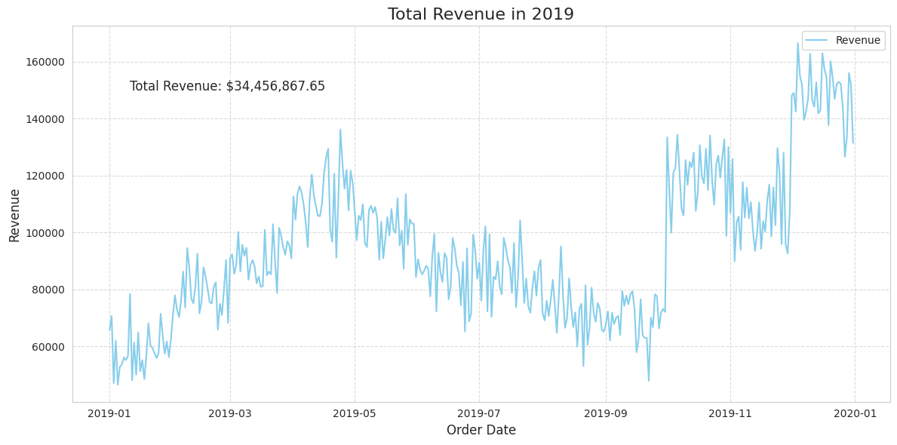

# Time Series Analysis: Forecasting Total Order

## Overview
This project conducts an in-depth exploratory data analysis (EDA) and time series analysis of e-commerce sales data from 2019. The primary goal is to uncover temporal patterns, understand key business drivers, and build a solid foundation for developing accurate sales forecasting models. This analysis provides valuable insights for strategic decision-making in marketing and inventory management.

## Objectives
1.  **Data Exploration and Cleaning:** To load, inspect, and preprocess the dataset for analysis.
2.  **Trend and Pattern Analysis:** To identify annual, monthly, and hourly patterns within the time series data.
3.  **Model Development and Comparison:** To build, evaluate, and compare two distinct forecasting models (SARIMA and Random Forest) to find the one with the lowest MAPE.
4.  **Forecasting:** To predict daily transaction totals for the next 30 days.

## Tech Stack
* **Data Manipulation & Analysis:** Pandas, NumPy
* **Data Visualization:** Matplotlib, Seaborn
* **Time Series & Statistical Modeling:** statsmodels (Seasonal Decompose, ARIMA, Holt-Winters)
* **Machine Learning:** Scikit-learn, RandomForestRegressor
  
## Exploratory Data Analysis (EDA) & Key Findings
After data preparation and cleaning, a thorough EDA was performed to extract initial insights.

### 1. Annual Sales (Revenue), Total Orders, and Quantity Sold Trends (2019)
The analysis of sales data throughout 2019 revealed significant trends and seasonality.

* **Overall Performance:** The business generated a **Total Revenue of ~$34.4 million** from **~178k orders**, with a **Total Quantity of ~208k units sold**.

* **Seasonal Patterns:** The data exhibits a clear seasonal pattern: an upward trend from January to April, a decline until September, followed by a sharp and sustained increase until the end of the year.

* **Holiday Season Impact:** The dramatic sales surge in the final quarter (Q4) strongly suggests a powerful impact from the holiday shopping season, including events like Black Friday and Christmas.

* **Metric Correlation:** The patterns for Total Revenue, Total Orders, and Quantity Sold are nearly identical. This implies that sales fluctuations are primarily driven by the volume of transactions.

### 2. Rush Hour Analysis (Hourly Order Patterns)
Analysis of hourly order data identifies two distinct peak periods for customer purchasing activity.

* **Peak Purchase Times:** The highest volume of orders occurs during two main windows:
    1.  **Lunchtime Peak:** 11:00 AM - 1:00 PM
    2.  **Evening Peak:** 5:00 PM - 8:00 PM
 
## Modeling and Forecasting

To forecast daily total orders for the next month, two different approaches were implemented: a traditional statistical model (SARIMA) and a machine learning model (Random Forest).

### 1. Data Preparation for Modeling

Before modeling, the data underwent further preparation:
* **Decomposition:** A **multiplicative model** was chosen for time series decomposition, as it provided a more stable residual plot compared to an additive model, indicating a better fit for the data's structure.
* **Stationarity Testing:** An Augmented Dickey-Fuller test confirmed the data was **non-stationary** (p-value > 0.05). Analysis of ACF and PACF plots on the differenced data suggested initial parameters for the SARIMA model.

### 2. Feature Engineering
To enable the machine learning model to understand complex temporal patterns, a rich set of features was engineered from the time index.
These features include:
* **Time & Calendar Features:** Year, month, day, day of the week, quarter, and `is_weekend`.
* **Cyclical Features:** Sin/Cos transformations for time-based features to capture cyclicality.
* **Lag Features:** Historical order data from 1 day, 7 days (weekly seasonality), and 365 days (yearly seasonality) prior.
* **Rolling Window Features:** Rolling mean and standard deviation over 7-day and 30-day windows to capture recent trends and volatility.

### 3. Model Development and Evaluation
The dataset was split into training (305 days), validation (30 days), and test (30 days) sets. Both models were trained and evaluated on the validation set.

| Model | RMSE (Validation) | MAE (Validation) | MAPE (Validation) |
| :--- | :--- | :--- | :--- |
| SARIMA `(1,1,1)(1,1,1,7)` | 75.87 | 64.49 | 11.41% |
| **Random Forest Regressor** | **47.38** | **37.71** | **6.60%** |

The **Random Forest Regressor** significantly outperformed the SARIMA model, achieving a much lower validation MAPE of **6.60%**.

### 4. Final Evaluation on Test Set
The best-performing model, the Random Forest Regressor, was then evaluated on the unseen test set. The final **Test MAPE was 16.19%**.

## Conclusion & Next Steps
The Random Forest model, while promising on the validation set, showed signs of **overfitting**, as its performance degraded on the test set (16.19% vs. 6.60%). The higher test error suggests the model struggled to generalize, possibly due to the sharp, unprecedented sales spike at the end of the year which was not fully captured during training.

This analysis serves as a strong baseline, and future iterations could include:
* **Advanced Feature Engineering:** Creating features for specific holidays (e.g., Black Friday, Christmas) and promotional events.
* **Hyperparameter Tuning:** Optimizing the Random Forest model's parameters to reduce overfitting.
* **Exploring Alternative Models:** Testing other powerful gradient-boosting models like LightGBM or XGBoost.
